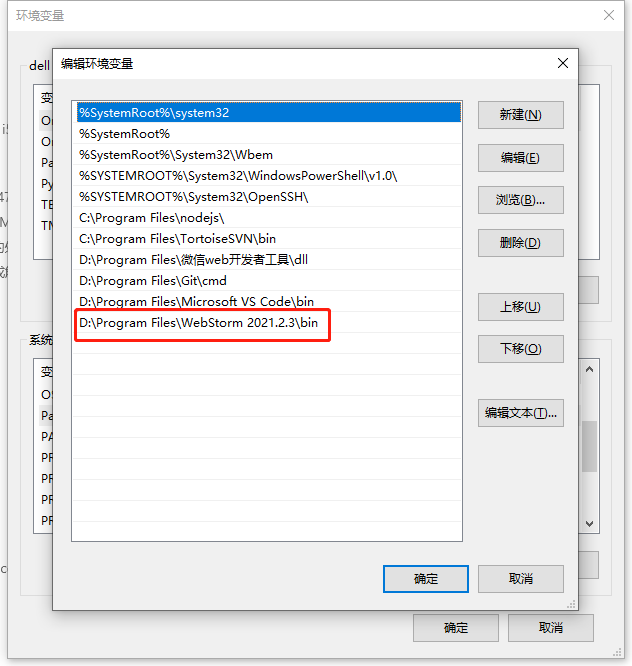

# 通过shift+左键点击页面元素,快速在vscode或webStorm中定位代码位置
## `暂时只支持vue + webpack + （vsCode || webStorm）编辑器`

# 引入
### 1. `code-link`文件夹拷贝到项目根目录（和src同级）
### 2. 配置
```
    // 在vue.config.js文件
    const addVueCodeLinkLoader = require('./code-link/add-location-loader/config.js')
    module.exports = {
        ...
        chainWebpack(config) {
          //添加vue-code-link处理器
          addVueCodeLinkLoader(config)
          ...
        }
    }
    
    // 在src/main.js文件
    // 添加一件打开对应的页面功能（开发模式功能）
    import codeLink from './../code-link/client'
    // type= webStorm是打开webStorm编辑器，vsCode是打开Visual Studio Code编辑器
    new codeLink({type: 'webStorm'})
```
### 3. 启动`server.js`的node服务
* 把server.js拷贝到电脑的任意位置并启动文件
* 小技巧：把`启动code-link服务.bat`文件拷贝到桌面并修改里面的`server.js`文件路径可点击一件启动服务。
* webStorm编辑器需要把安装目录配置到系统环境变量上，如下图

```
// node运行命令
node server.js
```

# 使用
shift+鼠标左键点击页面元素即可
# 注意事项
* 插件会自动根据生成与开发环境决定是否启用,不会对生产环境造成任何影响
* 插件启用时,会禁用默认的鼠标右键菜单
* 暂时只支持vue + webpack + （vscode || webStorm）编辑器
* webStorm暂时只支持打开页面，不支持定位到行
* 为什么要把server.js的服务接口单独用node运行，主要是在最新版的vue-cli里面webpack不允许引入node的child_process依赖，无法调用编辑器命令。
* 该项目借鉴了一位前端大佬的文章，[文章链接](https://mp.weixin.qq.com/s/AZQTK_lk8BxxWZCDU5P_Yg)。文章里有详细的设计思路和代码片段。
* 该项目参考前端大佬的https://www.npmjs.com/package/@linzhinan/vue-code-link组件修改的
